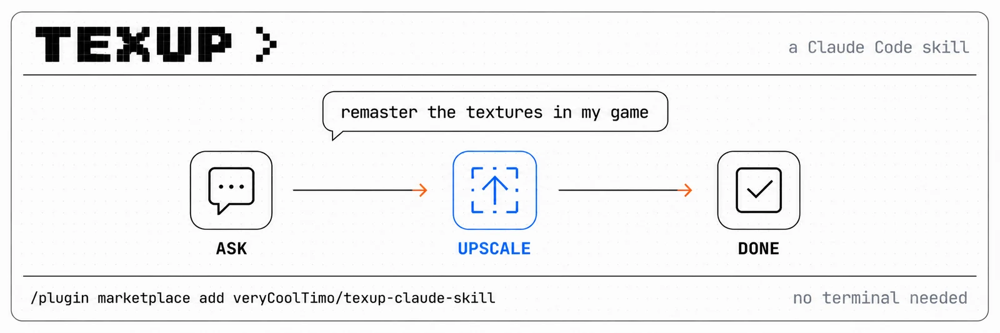

# texup — Texture Remaster Skill for Claude Code


A skill that remasters the textures of old games by chat. You point at a game folder and say what you want — the skill runs the [**texup**](https://github.com/veryCoolTimo/texture-auto-upscaler) tool for you, upscales every texture with the right neural model, and packs it back in the exact format the game expects. No terminal knowledge required.

Say something like *"remaster the textures in my Half-Life 2 install"* or *"улучши текстуры в Resident Evil 5"*. The skill scans the game, shows you before/after comparison sheets, asks two questions (quality mode, and whether to write into the game with backup or into a separate folder), then runs it — all locally on your machine.

Not a generative repaint: the goal is sharper surface detail that keeps the original art style intact.

## Installation

**Claude Code — plugin marketplace (recommended)**

```
/plugin marketplace add veryCoolTimo/texup-claude-skill
/plugin install texup-skill@texup
```

**Claude Code — manual (clone + symlink)**

```bash
git clone git@github.com:veryCoolTimo/texup-claude-skill.git
cd texup-claude-skill
ln -s "$(pwd)/skills/texup-remaster" ~/.claude/skills/texup-remaster
```

Restart Claude Code so it discovers the skill.

The skill installs and drives the `texup` CLI (from the [texture-auto-upscaler](https://github.com/veryCoolTimo/texture-auto-upscaler) repo). Everything runs locally — Apple Silicon (MPS), NVIDIA (CUDA), or CPU. Models download automatically on first run (~130 MB).

## Usage

Just describe what you want, in any language:

> remaster the textures in my Resident Evil 5 install

> улучши текстуры в игре, папка вот такая-то

> upscale my Half-Life 2 textures but keep it conservative

The skill scans the game, prints a summary (engine, texture counts, duplicates), renders before/after sheets so you approve the look with your eyes, then runs the upscale and — only if you agree — applies it into the game with a full backup. Changed your mind afterwards? Ask it to roll back and everything is restored.

## What it drives

`texup` is a local AI texture-remaster pipeline: scan → classify (diffuse / normal / material / UI / font) → route to the right super-resolution model per class → upscale → repack to the original format, with backup and rollback.

## Supported games

| Games | Formats |
|---|---|
| Any game with loose textures | PNG, JPG, TGA, BMP, DDS (BC1–BC7) |
| Resident Evil 5 / 0 HD / 6, Dragon's Dogma, DMC4 | MT Framework `.tex` + `.arc` |
| Half-Life 2, Portal, CS:S, TF2 and Source mods | VTF / VPK |
| Skyrim, Fallout 4 and Bethesda mods | BSA / BA2 |
| Quake III, Doom 3 and id-Tech era games | PK3 / PK4 |

Full details and verification numbers are in the [tool repo](https://github.com/veryCoolTimo/texture-auto-upscaler).

## Project structure

```
.claude-plugin/          marketplace + plugin manifests
skills/texup-remaster/   SKILL.md — the instruction Claude follows
assets/                  banner
```

## Related projects

- [**texture-auto-upscaler**](https://github.com/veryCoolTimo/texture-auto-upscaler) — the `texup` tool this skill drives
- [**imagegen-skills**](https://github.com/veryCoolTimo/imagegen-skills) — turn a one-line idea into a gold-quality image prompt

## License

[MIT](LICENSE)
